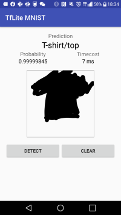
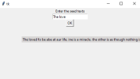
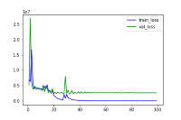
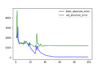

## Android_f_mnist

### 手書きの絵を判別するスマホアプリ

A smartphone app to identify handwritten pictures

I made an android application that can classify handwritten
pictures based on a model trained on f_mnist data.

f_mnist のデータを学習したモデルを基に、手書きの絵を分類することが
できるアンドロイドアプリを作った。

## Generate_Quotes

### 名言を生成する

I scraped the quotes from http://quotes.toscrape.com and saved them in a database.
The scraping was done using go lang. Using the data, I created a desktop
application that creates new quotes using the seq2seq model. (You can run it with python app.py).

http://quotes.toscrape.com から名言をスクレイピングしてデータベースに保存しておいた.
スクレイピングにはgo langを使用した.そのデータを使って、seq2seqモデルを用い、新たな名
言を作成するデスクトップアプリを作った.(python app.py で実行できる)

## Mercari

Predict the winning bid price of an item from its image on an auction site.

メルカリに出品されている商品の画像をVGG16で学習させ、その落札価格を予測する
試しに「オルチャン tops」で検索してスクレイピングした100枚で学習させたところ,
以下のような結果になった

このジャンルの価格の分散は2500円程度なので、あてずっぽうに価格を決めるよりは、適切な
価格の提示てきている?
